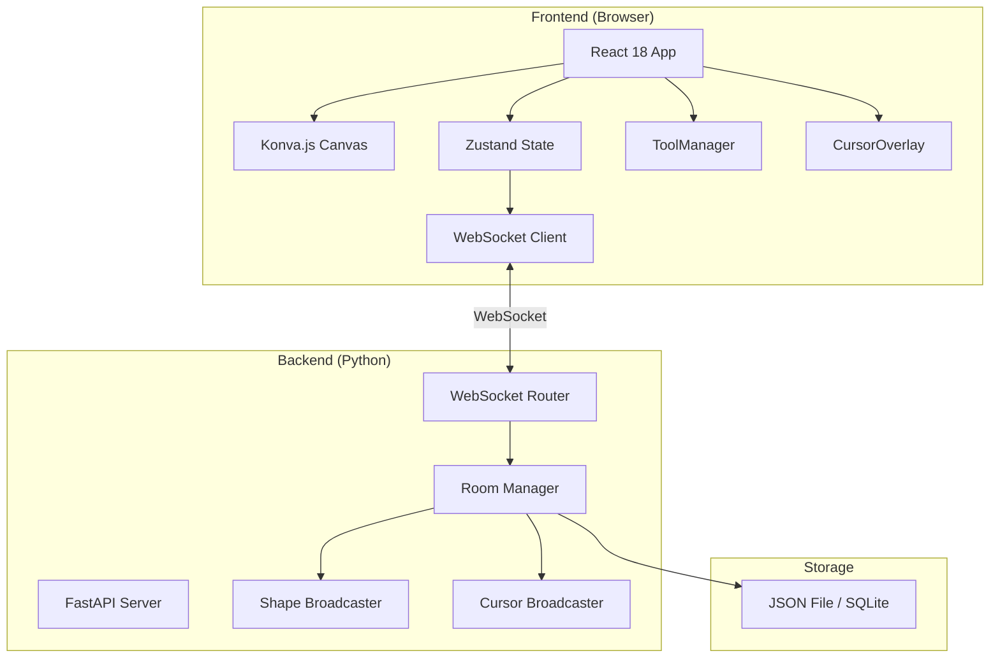
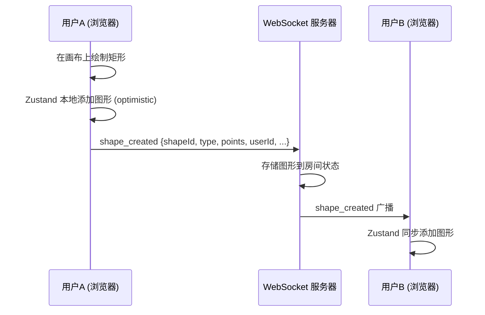

# 全栈协作白板 (Online Whiteboard) — 设计方案文档

> 版本: 1.0  
> 最后更新: 2026-05-08  
> 状态: MVP 已完成，持续迭代中

---

## 目录

1. [系统架构](#1-系统架构)
2. [技术栈选型理由](#2-技术栈选型理由)
3. [核心模块设计](#3-核心模块设计)
4. [WebSocket 通信协议](#4-websocket-通信协议)
5. [数据持久化策略](#5-数据持久化策略)
6. [开发阶段规划](#6-开发阶段规划)
7. [关键设计决策与演变](#7-关键设计决策与演变)
8. [项目文件结构](#8-项目文件结构)
9. [常用开发命令](#9-常用开发命令)
10. [后续迭代方向](#10-后续迭代方向)

---

## 1. 系统架构

### 1.1 整体架构图 (Mermaid)



### 1.2 数据流



**关键原则:**

- **乐观更新**: 发起者先在本地更新状态，再通过 WebSocket 同步
- **广播模式**: 服务器不处理业务逻辑，仅负责存储和转发
- **最后写入获胜 (LWW)**: 冲突时以最后到达服务器的消息为准

---

## 2. 技术栈选型理由

| 层级 | 技术 | 选型理由 |
|------|------|----------|
| **前端框架** | React 18 + TypeScript | 生态成熟，类型安全，社区资源丰富 |
| **构建工具** | Vite | 开发服务器秒级启动，HMR 极快，天然支持 TS |
| **样式方案** | TailwindCSS | 原子化 CSS，开发效率高，无需维护独立样式文件 |
| **画布引擎** | Konva.js (react-konva) | 声明式 Canvas API，内置事件系统、图层管理、Transformer；比直接操作 Canvas API 更适合交互密集型应用 |
| **状态管理** | Zustand | 轻量 (<1KB)，无 boilerplate，支持 subscribe + selector 模式，天然适合 WebSocket 驱动的实时状态同步 |
| **后端框架** | FastAPI | 原生 async/await，WebSocket 支持完善，自动生成 OpenAPI 文档 |
| **实时通信** | WebSocket (原生) | 全双工低延迟，无需额外依赖；比 Socket.IO 更轻量 |
| **数据存储** | JSON 文件 / SQLite | MVP 阶段极简方案，零配置，无需外部数据库服务 |

### 为什么不选其他方案?

| 备选 | 淘汰原因 |
|------|----------|
| Canvas API (裸) | 缺少图层、事件命中检测，需大量手写底层逻辑 |
| Redux | Boilerplate 过多，对于实时协作场景过于笨重 |
| Socket.IO | 功能过剩，依赖较重，原生 WebSocket 已满足需求 |
| PostgreSQL | MVP 阶段过度设计，引入运维成本 |
| CRDT (Yjs/Automerge) | 学习曲线陡峭，MVP 阶段 LWW 策略足够 |

---

## 3. 核心模块设计

### 3.1 前端模块

#### 3.1.1 Canvas 组件 (`WhiteboardCanvas.tsx`)

- 基于 `react-konva` 的 `Stage` + `Layer` 结构
- 主绘图 Layer（所有图形）
- 预览 Layer（绘制过程中的临时形状，如拖拽中的矩形虚线框）
- 远程光标 Layer（其他用户的光标叠加层）
- 处理鼠标/触摸事件，委托给 `ToolManager`

```
Layer 层级（从下到上）:
  1. Grid Layer     — 背景网格（可选）
  2. Shape Layer    — 已确认的图形
  3. Preview Layer  — 绘制中的临时预览
  4. Cursor Layer   — 远程用户光标
  5. Selection Layer — 选中框/Transformer
```

#### 3.1.2 ToolManager (`ToolManager.ts`)

- 管理当前激活的工具 (brush, rectangle, circle, arrow, text, select)
- 将原始鼠标事件翻译为工具特定行为
- 键盘快捷键处理:
  - `Delete` — 删除选中图形（需所有权检查）
  - `Ctrl+Z` — undoOwn
  - `Ctrl+Shift+Z` — redoOwn（计划中）
  - `V` — 选择工具
  - `B` — 画笔
  - `R` — 矩形
  - `C` — 圆形
  - `A` — 箭头
  - `T` — 文本

#### 3.1.3 Toolbar 组件 (`Toolbar.tsx`)

- 工具按钮列表，高亮当前工具
- 撤销按钮（调用 `undoOwn`）
- 颜色选择器
- 线宽选择器

#### 3.1.4 CursorOverlay 组件 (`CursorOverlay.tsx`)

- 渲染其他用户的远程光标
- 每个光标显示:
  - 用户颜色标识的十字准星
  - 用户名称标签（跟随光标）
- 节流策略: 本地光标位置 100ms 节流后发送

#### 3.1.5 RoomPanel 组件 (`RoomPanel.tsx`)

- 创建房间（生成 roomId）
- 加入房间（输入 roomId）
- 显示当前房间在线用户列表
- 复制房间链接/ID

#### 3.1.6 Zustand Store (`useCanvasStore.ts`)

```typescript
interface CanvasState {
  // 图形数据
  shapes: Shape[];              // 当前画布所有图形
  selectedId: string | null;    // 当前选中的图形 ID

  // 工具状态
  activeTool: ToolType;         // brush | rect | circle | arrow | text | select
  toolColor: string;
  toolWidth: number;

  // 用户与房间
  userId: string;
  userName: string;
  roomId: string | null;
  users: UserInfo[];            // 在线用户列表

  // 远程光标
  remoteCursors: Map<string, CursorPosition>;

  // 操作
  addShape: (shape: Shape) => void;
  updateShape: (id: string, data: Partial<Shape>) => void;
  deleteShape: (id: string) => void;
  undoOwn: (userId: string) => string | null;  // 返回被删除的 shapeId
  setActiveTool: (tool: ToolType) => void;
  // ...
}
```

### 3.2 后端模块

#### 3.2.1 WebSocket 路由 (`ws.py` 或 `main.py` 内联)

- 端点: `ws://host:port/ws/{room_id}?userId={uid}&userName={name}`
- 连接建立 → 加入房间 → 广播 `user_joined`
- 连接断开 → 离开房间 → 广播 `user_left`
- 消息分发到对应房间的广播处理器

#### 3.2.2 房间管理 (`RoomManager`)

```python
class RoomManager:
    rooms: Dict[str, Room]  # roomId -> Room

class Room:
    room_id: str
    connections: Dict[str, WebSocket]  # userId -> ws
    shapes: List[dict]                 # 房间内所有图形
    # 当连接数为 0 时可触发持久化
```

#### 3.2.3 消息处理流程

```
客户端消息 → WebSocket.receive_text()
  → 解析 JSON → 根据 type 路由:
    ├─ shape_created  → 存储 + 广播给房间其他用户
    ├─ shape_updated  → 更新 + 广播
    ├─ shape_deleted  → 删除 + 广播
    ├─ cursor_move    → 广播给房间其他用户
    └─ ping/pong      → 心跳回复
```

---

## 4. WebSocket 通信协议

### 4.1 消息格式

所有消息统一使用 JSON 格式:

```json
{
  "type": "message_type",
  "payload": { ... },
  "userId": "sender_user_id",
  "timestamp": 1715700000000
}
```

### 4.2 消息类型定义

| 类型 | 方向 | Payload | 说明 |
|------|------|---------|------|
| `shape_created` | C→S→All | `{ shape }` | 新图形创建 |
| `shape_updated` | C→S→All | `{ shapeId, changes }` | 图形属性变更（移动、缩放、样式） |
| `shape_deleted` | C→S→All | `{ shapeId }` | 图形删除 |
| `cursor_move` | C→S→Others | `{ x, y }` | 光标位置更新（节流 100ms） |
| `user_joined` | S→All | `{ userId, userName, color }` | 新用户加入房间 |
| `user_left` | S→All | `{ userId }` | 用户离开房间 |
| `room_state` | S→C | `{ shapes, users }` | 新用户加入时的全量同步 |
| `ping` / `pong` | C↔S | `{}` | 心跳保活（30s 间隔） |

### 4.3 Shape 数据结构

```typescript
interface Shape {
  id: string;           // UUID
  type: 'brush' | 'rectangle' | 'circle' | 'arrow' | 'text';
  userId: string;       // 创建者 ID（用于所有权检查）
  points?: number[];    // brush/arrow 路径点
  x?: number;           // 矩形/圆形/文本 位置
  y?: number;
  width?: number;       // 矩形宽
  height?: number;      // 矩形高
  radius?: number;      // 圆形半径
  text?: string;        // 文本内容
  color: string;        // 颜色
  strokeWidth: number;  // 线宽
  createdAt: number;    // 创建时间戳
  version?: number;     // 乐观锁版本号（计划中）
}
```

---

## 5. 数据持久化策略

### 5.1 MVP 阶段（当前）

- **无持久化**: 图形数据仅存在于服务器内存中的 `Room.shapes`
- **风险**: 所有用户断开后，房间数据丢失

### 5.2 简易持久化（计划中 — 见 5.4 节 Prompt）

- **方案**: JSON 文件或 SQLite
- **触发时机**: 最后一个用户离开房间时序列化 `Room.shapes` 到磁盘
- **加载时机**: 第一个用户进入房间时从磁盘反序列化
- **文件路径**: `backend/data/{room_id}.json`

```python
# 伪代码
async def on_user_leave(room_id: str):
    room = room_manager.rooms.get(room_id)
    if room and len(room.connections) == 0:
        save_to_file(f"data/{room_id}.json", room.shapes)

async def on_user_join(room_id: str):
    if room_id not in room_manager.rooms:
        shapes = load_from_file(f"data/{room_id}.json")
        room_manager.create_room(room_id, shapes)
```

### 5.3 未来方向

- 数据库升级: SQLite → PostgreSQL（需要查询/索引时）
- 操作日志: 记录完整的操作历史用于审计和回放
- 定期快照 + 增量日志以减少存储和加载时间

---

## 6. 开发阶段规划

### MVP (已完成 — commit `6a516cb`)

- [x] 项目脚手架搭建
- [x] 5 种绘图工具: brush, rectangle, circle, arrow, text
- [x] WebSocket 实时协作（广播同步）
- [x] 房间系统（创建/加入）
- [x] 远程光标显示（含颜色和名称标签）
- [x] 撤销功能（初版全局历史栈）
- [x] 基础 Toolbar 和 Canvas

### 迭代 1: 协作体验增强 (已完成 — commit `3102a90`)

- [x] undoOwn 重构 — 基于用户所有权的撤销
- [x] 删除权限检查 — 只有创建者可删除
- [ ] redoOwn 扩展 — Ctrl+Shift+Z
- [ ] 光标节流优化 — 100ms throttle

### 迭代 2: 稳健性与持久化 (计划中)

- [ ] LWW 冲突处理策略
- [ ] 图形数据持久化（JSON/SQLite）
- [ ] 缩放和平移画布
- [ ] 图形层级调整（z-index）
- [ ] 撤销重做栈完善

### 迭代 3: 协作增强

- [ ] 图形锁定（防止他人误操作）
- [ ] 操作历史面板
- [ ] 选区多人协作提示
- [ ] 文字工具富文本支持

---

## 7. 关键设计决策与演变

### 7.1 撤销功能: 全局栈 → undoOwn

**初始设计 (MVP):**
```
全局 history 栈: [操作1, 操作2, 操作3, ...]
撤销时: history.pop() → 移除最后一个操作对应的图形
```

**问题:**
用户 A 执行撤销时，可能删除了用户 B 刚创建的图形，造成协作冲突。

**重构方案 (`3102a90`):**
```
移除全局 history/redoStack
新增 undoOwn(userId):
  shapes 数组倒序遍历
  → 找到第一个 userId 匹配的图形
  → 从 shapes 中删除
  → 通过 WebSocket 广播 shape_deleted
```

**设计取舍:**
- 优势: 语义清晰，不会误删他人图形
- 劣势: 无法跨用户撤销操作序列（但协作场景下这本身就不合理）
- 当前未实现 redo，但预留了扩展空间

### 7.2 同步策略: 广播式 vs CRDT

**选择: 广播式（MVP）**

- 服务器不处理冲突，仅存储和转发
- 乐观更新: 发起者本地先更新
- 冲突处理: 最后写入获胜 (LWW)

**未来可选升级路径:**
- 引入 `version` 字段做乐观锁
- 冲突时服务器拒绝低版本更新，客户端需重新拉取
- 复杂场景可引入 CRDT（Yjs），但 MVP 阶段性价比低

### 7.3 删除权限

- 图形带 `userId` 字段标记创建者
- 只有创建者可删除自己的图形
- 兼容旧数据: 无 `userId` 的图形允许任何人删除
- 非创建者选中图形时 UI 隐藏删除按钮

### 7.4 远程光标性能

- 问题: 每次 `mousemove` 都发送 WebSocket 消息 → 消息风暴
- 方案: 客户端 100ms throttle，仅发送 `{userId, x, y}`
- 使用 `requestAnimationFrame` + 时间戳实现节流
- 未来可考虑二进制消息进一步压缩

---

## 8. 项目文件结构

```
online-whiteboard/
├── frontend/
│   ├── index.html
│   ├── package.json
│   ├── vite.config.ts
│   ├── tailwind.config.js
│   ├── tsconfig.json
│   ├── postcss.config.js
│   └── src/
│       ├── main.tsx                    # React 入口
│       ├── App.tsx                     # 根组件
│       ├── index.css                   # Tailwind 基础样式
│       ├── components/
│       │   ├── WhiteboardCanvas.tsx    # 画布核心组件
│       │   ├── Toolbar.tsx             # 工具栏
│       │   ├── CursorOverlay.tsx       # 远程光标叠加层
│       │   ├── RoomPanel.tsx           # 房间面板
│       │   └── UserList.tsx            # 在线用户列表
│       ├── store/
│       │   └── useCanvasStore.ts       # Zustand 全局状态
│       ├── managers/
│       │   └── ToolManager.ts          # 工具管理与事件分发
│       ├── services/
│       │   └── websocket.ts            # WebSocket 客户端封装
│       ├── tools/
│       │   ├── BrushTool.ts
│       │   ├── RectangleTool.ts
│       │   ├── CircleTool.ts
│       │   ├── ArrowTool.ts
│       │   ├── TextTool.ts
│       │   └── SelectTool.ts
│       └── types/
│           └── index.ts                # 共享类型定义
├── backend/
│   ├── requirements.txt
│   ├── run.py                          # uvicorn 启动入口
│   ├── main.py                         # FastAPI 应用 + WebSocket 路由
│   ├── room_manager.py                 # 房间管理逻辑
│   └── data/                           # 持久化数据目录（计划中）
└── docs/
    └── design-doc.md                   # 本文档
```

---

## 9. 常用开发命令

```bash
# 启动前端开发服务器 (Vite HMR)
cd frontend && npm run dev

# 启动后端 (FastAPI + uvicorn, 默认端口 8000)
cd backend && python run.py

# TypeScript 类型检查
cd frontend && npx tsc --noEmit

# 安装前端依赖
cd frontend && npm install

# 安装后端依赖
cd backend && pip install -r requirements.txt
```

---

## 10. 后续迭代方向

| 优先级 | 功能 | 说明 | 关联 Prompt |
|--------|------|------|-------------|
| P0 | 光标节流 | 100ms throttle，减少消息量 | 5.1 |
| P0 | 图形持久化 | JSON/SQLite 存储 | 5.4 |
| P1 | LWW 冲突处理 | 版本号 + 乐观锁 | 5.2 |
| P1 | redoOwn | 用户维度重做栈 | 5.3 |
| P1 | 画布缩放/平移 | Stage scale + offset | — |
| P2 | 图形锁定 | 防止他人误编辑 | — |
| P2 | 操作历史面板 | UI 展示可回滚的操作 | — |
| P3 | 文字富文本 | 字体、大小、对齐 | — |
| P3 | 图片导入 | 拖拽/粘贴图片到画布 | — |
| P3 | 导出功能 | PNG/SVG/PDF 导出 | — |
| P3 | CRDT 升级 | 无冲突数据类型替换 LWW | — |

---

## 附录 A: Git 关键提交

| 主题 | 涉及文件 | 提交 Hash |
|------|----------|-----------|
| MVP 版本 | 全部前端/后端文件 | `6a516cb` |
| undoOwn 重构 | useCanvasStore.ts, Toolbar.tsx, WhiteboardCanvas.tsx, ToolManager.ts | `3102a90` |
| 截图与文档 | 测试截图/, docs/ | `d21fd18` |

## 附录 B: Shape 类型定义 (TypeScript)

```typescript
type ToolType = 'select' | 'brush' | 'rectangle' | 'circle' | 'arrow' | 'text';

type ShapeType = 'brush' | 'rectangle' | 'circle' | 'arrow' | 'text';

interface BaseShape {
  id: string;
  type: ShapeType;
  userId: string;
  color: string;
  strokeWidth: number;
  createdAt: number;
  version?: number;
}

interface BrushShape extends BaseShape {
  type: 'brush';
  points: number[];  // [x1, y1, x2, y2, ...]
}

interface RectangleShape extends BaseShape {
  type: 'rectangle';
  x: number;
  y: number;
  width: number;
  height: number;
}

interface CircleShape extends BaseShape {
  type: 'circle';
  x: number;
  y: number;
  radius: number;
}

interface ArrowShape extends BaseShape {
  type: 'arrow';
  points: number[];  // [startX, startY, endX, endY]
}

interface TextShape extends BaseShape {
  type: 'text';
  x: number;
  y: number;
  text: string;
  fontSize?: number;
}

type Shape = BrushShape | RectangleShape | CircleShape | ArrowShape | TextShape;
```

## 附录 C: WebSocket 消息完整示例

### 图形创建

```json
// Client → Server
{
  "type": "shape_created",
  "userId": "user_a1b2c3",
  "timestamp": 1715700000000,
  "payload": {
    "shape": {
      "id": "shape_d4e5f6",
      "type": "rectangle",
      "userId": "user_a1b2c3",
      "x": 100,
      "y": 150,
      "width": 200,
      "height": 100,
      "color": "#3B82F6",
      "strokeWidth": 2,
      "createdAt": 1715700000000
    }
  }
}

// Server → Other Clients (广播)
{
  "type": "shape_created",
  "userId": "user_a1b2c3",
  "timestamp": 1715700000010,
  "payload": {
    "shape": { /* 同上 */ }
  }
}
```

### 用户加入

```json
// Server → All Clients
{
  "type": "user_joined",
  "userId": "user_a1b2c3",
  "timestamp": 1715700000000,
  "payload": {
    "userId": "user_a1b2c3",
    "userName": "Alice",
    "color": "#EF4444"
  }
}
```

### 房间状态同步 (新用户加入时)

```json
// Server → New Client (仅发送给新加入的用户)
{
  "type": "room_state",
  "userId": "server",
  "timestamp": 1715700000000,
  "payload": {
    "shapes": [ /* 房间内所有现有图形 */ ],
    "users": [
      { "userId": "user_a1b2c3", "userName": "Alice", "color": "#EF4444" },
      { "userId": "user_d4e5f6", "userName": "Bob", "color": "#10B981" }
    ]
  }
}
```

### 光标移动 (节流后)

```json
// Client → Server (throttled 100ms)
{
  "type": "cursor_move",
  "userId": "user_a1b2c3",
  "timestamp": 1715700000000,
  "payload": {
    "x": 320,
    "y": 480
  }
}

// Server → Other Clients (广播)
{
  "type": "cursor_move",
  "userId": "user_a1b2c3",
  "timestamp": 1715700000010,
  "payload": {
    "x": 320,
    "y": 480
  }
}
```
